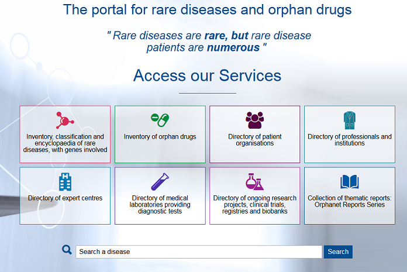
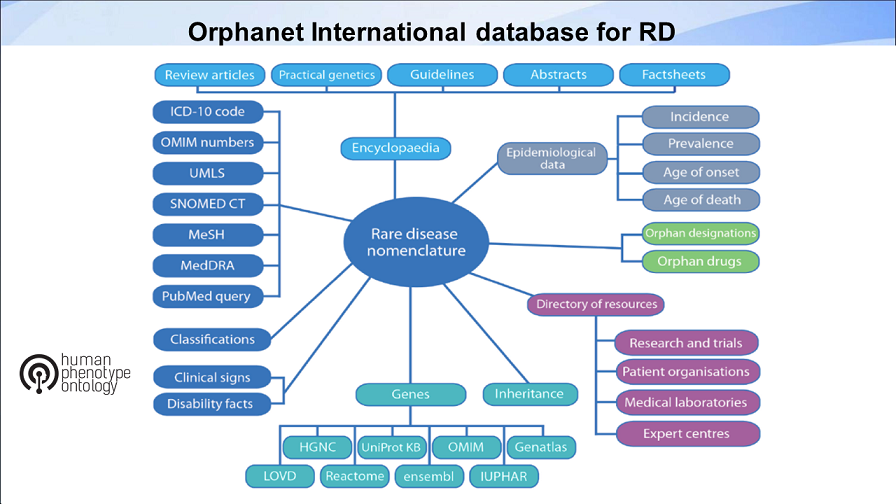
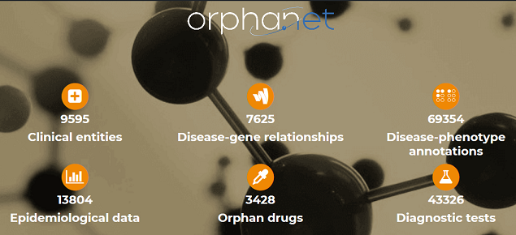
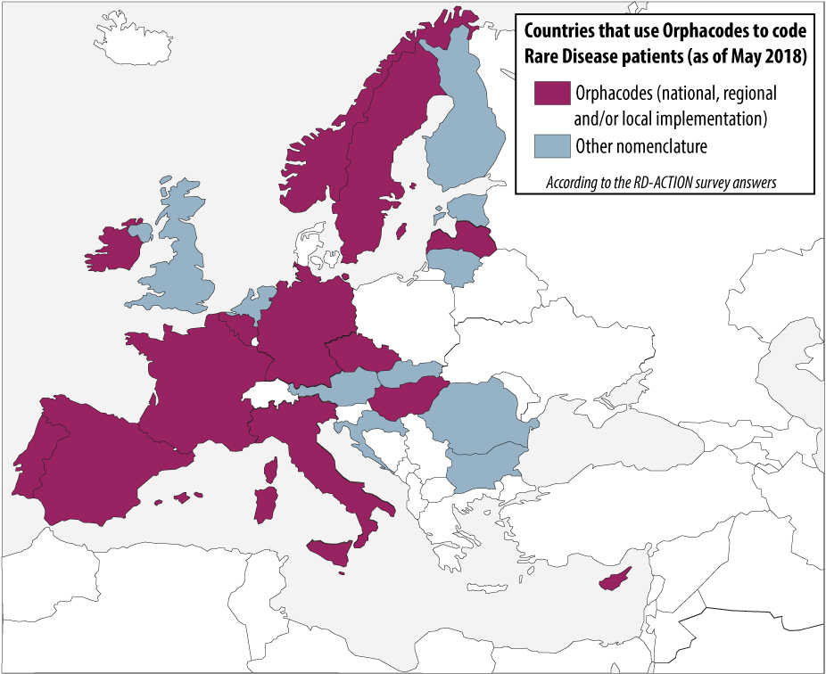
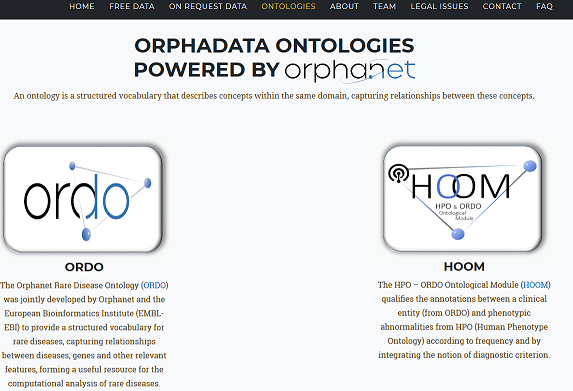
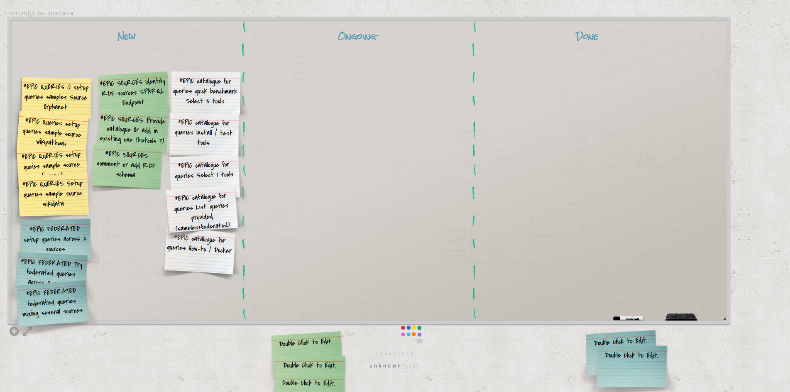
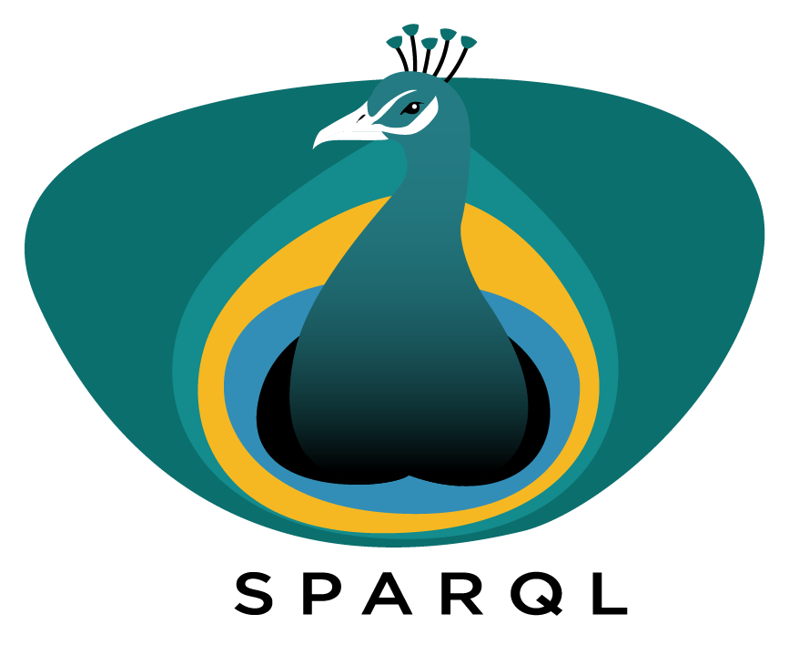

[](https://gitter.im/bh2018paris/13-SPARQL-RareDiseases?utm_source=badge&utm_medium=badge&utm_campaign=pr-badge&utm_content=badge)


# Development of a catalog of federated SPARQL queries in the field of Rare Diseases

### Representative: Marc Hanauer

## Community
---

Orphanet INSERM US14 - ELixir FR - Excelerate WP8 RD use case

## Leads
---
Marc Hanauer, Andra Waagmeester

## Background information
---
Orphanet is a website dedicated to rare diseases, providing several kind of information such nomenclature, classifications, textual information, disorders/genes relations and also dedicated resources in the field (Experts centres, Diagnostic tests, clinical trials, orphandrugs, registries and biobanks, supports groups etc.) for more than 40 countries. 
The site has a huge audience, around 1 million unique visitors/month and 8 languages. 


The database content is linked to the Orphanet nomenclature



and we provide several dataset, also accessible on our platform Orphadata https://www.orphadata.org



Orphanet produce also the Orphanet Rare Diseases Ontology and clinical description of diseases using HPO ontology. Each disease concept has a unique, stable, identifier (Orphacode) which could be used to identify diseases in health information system. The orphacode has been integrated in several countries.



## Expected outcomes
---

Orphanet provides an ontology (ORDO) for rare diseases and also an ontological module (HOOM) to disseminate phenotypic information based on HPO. ORDO+HOOM are available with a blazegraph docker image and also a sparql endpoint. 


http://www.orphadata.org/cgi-bin/sparql.html

Blazegraph docker with ORDO and HOOM

http://www.orphadata.org/cgi-bin/docker/blazegraph_ordo_v2.6_hoom_v1.1.tar.gz

We will try to leverage the knowledge of RD by the uses of accessible sparql endpoint (EBI, wikidata, wikipathway, bio2rdf etc.) and provides a catalogue of relevant federated sparql queries

## Expected audience
---

programmes, ontologists : python, java, RDF/OWL, Sparql
**Expected hacking days**: 3 days

## Approaches to reach goals
1) Identify relevant resource in the RD field, available through SPARQL Endpoint
Starting point: EBI, Uniprot, Wikidata, Bioportal, Bio2RDF, neXtProt...

https://www.ebi.ac.uk/rdf/services/sparql

https://sparql.uniprot.org/sparql

https://sparql.nextprot.org/

https://github.com/bio2rdf/bio2rdf-scripts/wiki

Reactome
https://www.ebi.ac.uk/rdf/services/sparql


Disgenet
http://www.disgenet.org
http://rdf.disgenet.org/sparql/


wikipathways
https://www.wikipathways.org/index.php/Help:WikiPathways_Sparql_queries
http://sparql.wikipathways.org/


2) Setup user friendly web interface to :

a) manage/comment datasource

b) provide sample queries for each datasource

c) edit and manage queries

YAS GUI
http://about.yasgui.org/

https://github.com/comunica

http://jupyter.org/

https://pypi.org/project/sparqlkernel/

Wikibase
https://github.com/wmde/wikibase-docker


3) Modelise several SPARQL Federated Queries

Tasks can be done in parallel

## Tasks management
Kaban scrumblr
http://scrumblr.ca/bh2018-orphanet


## Related works and references
---

- https://www.orpha.net
- http://www.orphadata.org
- https://www.orpha.net/sparql

## GitHub or any other public repositories of your FOSS products (if any)
---

- https://github.com/Orphanet/Orphadata.org 

## Hackers
YOU !
---

## Hack Day 1 progress
---

- Setup a wikibase which will contain sources description, "queries" in natural languages and federated queries examples
(wikibase is an extension of mediawiki)
```
https://www.mediawiki.org/wiki/Wikibase/Installation#Download_from_Git
```


http://185.54.113.31:8181/wiki/Main_Page


- Based on "natural languages queries" (a use case), start to explore Orphanet Ontology and Disgenet 
```
- For a given disease in Orphanet find all known related genes in Orphanet itself 
- For a given disease in Orphanet find all known related genes in DisGeNET 
Compare the output of the two queries. 
```

- Parallel task: play with the ORDO/HPO association model (dealing with collection)

## Hack Day 2 progress
---
Enrich the wikibase with sparql queries
- For each gene of a given rare disease (i.e. ORDO) find all known drugs to target that gene in ChEMBL. 
- Gene disease association from manually curated sources (in disgenet)
- List Genes and related diseases in Orphanet (obtain Gene name, Symbol, Orphanet ID, HGNC xref, Disease name and Orphanumber )
etc.

ISSUE: even with good known model (disgenet) and proper request, at data level some errors occurs (concept mapping issues)
=> add in wikibase an issue report (or linked to proper issue tracker for the source if exists)

Start to write Shape Expression (SHex) for Orphanet (Ordo) model

## Hack Day 3 & 4 progress
---
Having a nice peacock logo ! 

- finishing setup of queries http://185.54.113.31:8181
- having wikidata query facility running http://185.54.113.31:8282/ 
- Shape Expression is definitely needed for endpoint resource
- try to work on docker version
