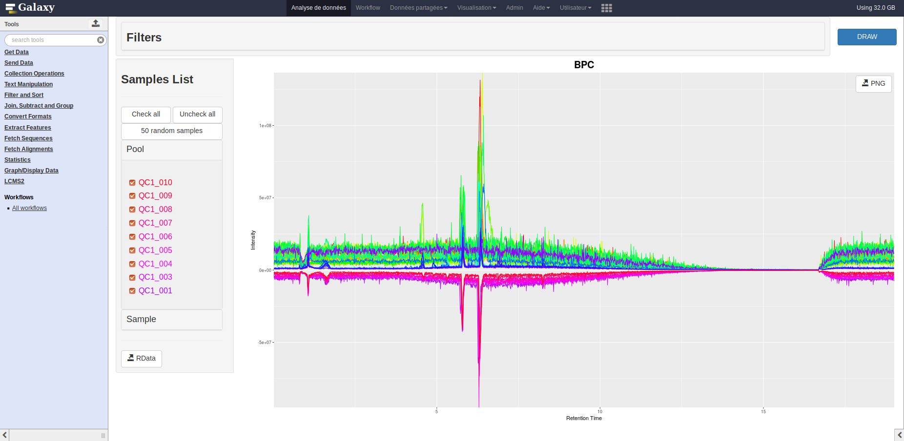
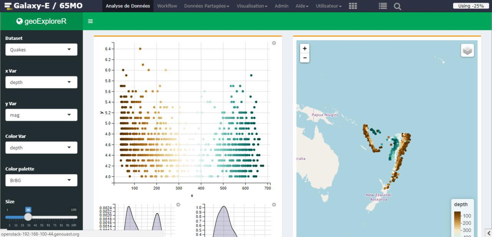

# Improve Shiny and RStudio integration within Galaxy using Galaxy Interactive Environment

Representative: Gildas Le Corguillé

## Community

The ELIXIR Galaxy Community and the ELIXIR Metabolomics Community

## Leads

- Gildas Le Corguillé ([github](lecorguille))
- Yvan Le Bras ([github](yvanlebras))
- Helena Rasche ([hxr@informatik.uni-freiburg.de](mailto:hxr@informatik.uni-freiburg.de) [github](https://github.com/erasche), [chat on gitter](https://gitter.im/erasche))

## Background Information

[Shiny](https://shiny.rstudio.com) is a powerful R package to display and interact with data (e.g. visualisation of raw data, statistics, geographic information system, ...). [Galaxy Interactive Environments](https://docs.galaxyproject.org/en/master/admin/special_topics/interactive_environments.html) allows running Shiny inside of [Galaxy](https://galaxyproject.org), isolated within [Docker containers](https://docker.com). Several projects are currently interested in embracing and enhancing Shiny-IEs: pGalaxy-E](https://github.com/65MO/Galaxy-E) (ELIXIR-FR) for ecology and [Workflow4Metabolomics](http://workflow4metabolomics.org/) (ELIXIR-FR) for metabolomics research. Additionally a GIE for RStudio exists providing an environment for developing R code, integration between these two GIEs could provide an enhanced workflow for developing novel Shiny GIEs within Galaxy.

## Expected outcomes

We have lots of plans for this week:

- Administration
  - Simplify/Automate installation of IEs
  - Improve flexibility, allow working with Datasets Collections and multiple Datasets
- Technology
  - Implement Galaxy FUSE driver and a Docker Volume plugin to allow running IEs without shared filesystem
- Documentation
  - Document installation and configuration of IEs
  - Document newly built Docker Volume plugin
- Participant Issues
  - Solve some participants problems during some "Bring Your Own Issues" sessions

## Expected audience

Developers, DevOps, System Administratorys

Skills wanted (and/or):
 - Galaxy Framework
 - Container technologies: Docker or Singularity
 - R, RShiny
 - D3.js, Plotly
 - Nginx, NodeJS

**Expected hacking days**: 2 days ...

## GitHub or any other public repositories of your FOSS products

### Workflow4Metabolomics

- [Workflow4Metabolomics GIE base container for Shiny](https://github.com/workflow4metabolomics/gie-shiny)
- [Workflow4Metabolomics GIE for Chromatograms Visualisation](https://github.com/workflow4metabolomics/gie-shiny-chromato)

### Galaxy-E

- [Galaxy-E GIE for Shiny](https://github.com/65MO/Galaxy-E/tree/master/GIE)

### Galaxy GIE for RStudio

- [Galaxy GIE for RStudio](https://github.com/erasche/docker-rstudio-notebook/)

## Hackers

- Helena Rasche ([hxr@informatik.uni-freiburg.de](mailto:hxr@informatik.uni-freiburg.de) [github](https://github.com/erasche), [chat on gitter](https://gitter.im/erasche))
- Romain Dallet ([github](RomainDallet))
- Gildas Le Corguillé ([github](lecorguille))
- Yvan Le Bras ([github](yvanlebras))

## Slides

- 12/11/2018: [Presentation](https://docs.google.com/presentation/d/1iXeSg2QkgJGv_rbe_v03hzY0GIZkvMkBA2-VTO3-70k/edit?usp=sharing)

