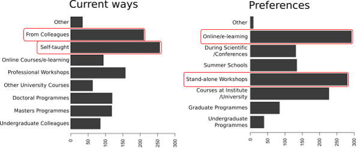
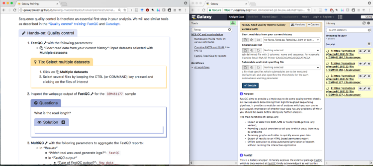
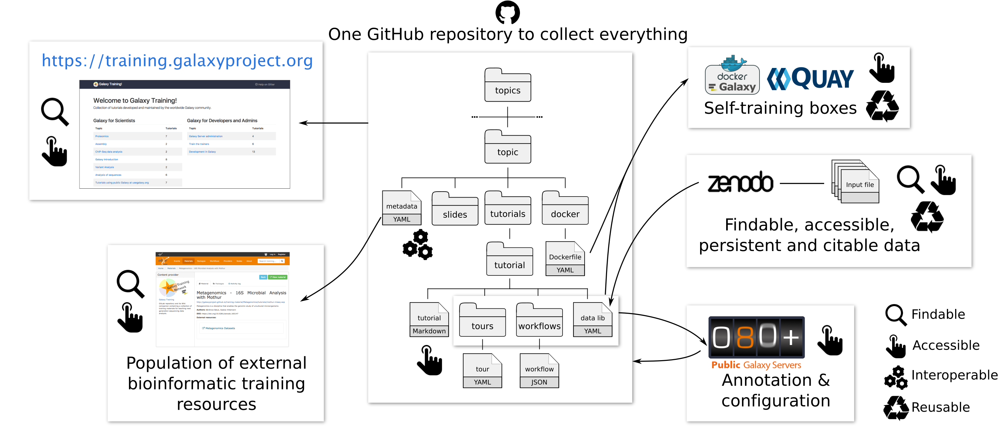
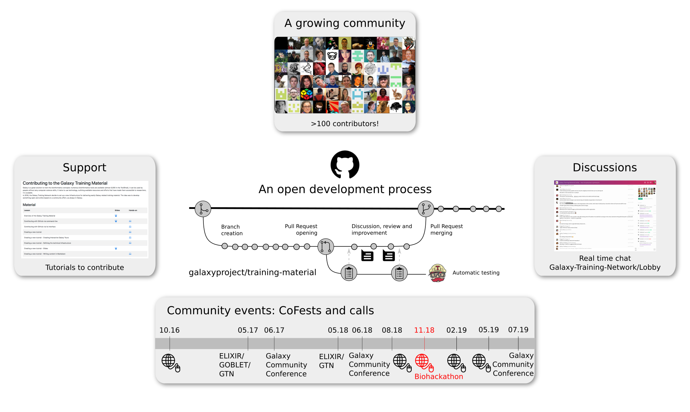
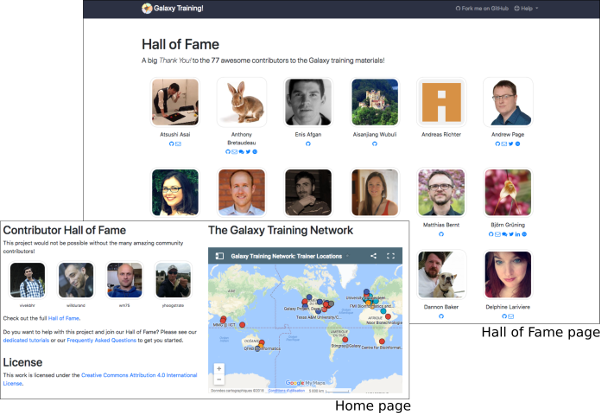

# Galaxy training material improvement and extension

### Representative: Bérénice Batut

[Introduction slides](http://bebatut.fr/talks/18/11_12_biohackathon/)

## Community
---

Galaxy community, Training platform

## Leads
---
- Bérénice Batut (berenice.batut@gmail.com, [chat on gitter](https://gitter.im/bebatut))
- Saskia Hiltemann (saskia.hiltemann@gmail.com, [chat on gitter](https://gitter.im/shiltemann)
- Björn Grüning (bjoern.gruening@gmail.com, [chat on gitter](https://gitter.im/bgruening))

## Motivation
---

Bioinformatics has become too central to biology to be left to specialist bioinformaticians. We believe that the domain experts (biologists, researchers, clinicians) should be empowered to analyze their own data. The [Galaxy framework](https://galaxyproject.org) allows users to run complex bioinformatics tools without the need of any programming knowledge and with nothing more than an web browser.

There is a clear demand for online, accessible bioinformatics training, with a recent survey by [Brazas et al](http://biorxiv.org/content/early/2017/02/27/098996) that while most people currently learn bioinformatics by themselves or from colleagues, they would prefer to be learning through workshops or online e-learning courses.

Our aim with this project is to provide a set of curated, **interactive** training materials, centered around **real-world research questions** and maintained by the **global community**, which are suitable to be used in both by instructors in **workshops** as by learners for **self-study**.

## Background information
---
[Galaxy](https://galaxyproject.org) is an open-source web framework for easy-to-use, reproducible and shareable computational life science research, with >100 public Galaxy servers. Training is an integral part of the Galaxy community. In collaboration with [GOBLET](https://www.mygoblet.org/) and the [ELIXIR Training Platform](https://www.elixir-europe.org/platforms/training), the [Galaxy Training Network](https://galaxyproject.org/teach/gtn/) is developing open, peer-reviewed and FAIR training material: >80 tutorials developed by >100 contributors, available at https://training.galaxyproject.org, to deliver training for scientists, developers and system administrators. The material is complemented by metadata to automatically populate the [ELIXIR training portal (TeSS)](https://tess.elixir-europe.org/) and to describe the technical infrastructure needed to run the tutorial (e.g. tools, data, workflows, etc.).

This is a **community-driven** project; all developments are made on an **open** [GitHub repository](https://github.com/galaxyproject/training-material/), and we have a [dedicated chat (Gitter)](https://gitter.im/Galaxy-Training-Network/Lobby) for any discussions and questions. Furthermore, we have regular Contribution/Commmunity/Cooperation fests, [**CoFests**](https://www.galaxyproject.org/events/2018-11-gtn/) for short, where we **work together** on improving and extending the materials, and have regular **community meetings** where we discuss the state of the project and decide on future directions as a community.

The project is aimed at making the contribution process as easy as possible, so that no specific knowledge or skills are required from contributors, and there are extensive [training materials about how to contribute to this project](https://galaxyproject.github.io/training-material/topics/contributing://galaxyproject.github.io/training-material/topics/contributing/)

## Goals and Expected outcomes
---

We have many ideas for this week, and participants can work on a wide range of topics depending on their interests:

- **Content**
  - Add new topics, new tutorials
  - [Training Handbook for instructors](https://github.com/galaxyproject/training-material/pull/1101)
  - Test existing tutorials and make improvements or [file issues](https://github.com/galaxyproject/training-material/issues)
    - [List of tutorials needing some love](https://github.com/galaxyproject/training-material/issues/807)
  - Review [open pull requests](https://github.com/galaxyproject/training-material/pulls)

- **Global Infrastructure**
  - FAIRness evaluation of the training
  - Plan internationalisation and localisation support in order to make the training material available to users in their own language
  - [BioSchemas](http://bioschemas.org/) support
  - Complete integration with the [TeSS workflow annotator](https://tess.elixir-europe.org/workflows)

- **Technical support**
  - Workflow testing
  - Docker images
  - [Interactive tours](https://crs4.github.io/Galaxy4Developers/lectures/09.galaxy_interactive_tours/)

- **Community**
  - More visibility for training events
  - Support for Instructors
  - [Share your training philosophy](https://github.com/galaxyproject/training-material/issues/1056) and tips to help other instructors

For those looking for ideas for things to work on this week, check out the [open issues and pull requests with the *cofest* label](https://github.com/galaxyproject/training-material/labels/CoFest): 

## Expected audience
---

We welcome everybody to join our hackathon this week; instructors, and anyone else eager to develop Galaxy-related training material.

**No specific knowledge or skills are required, just motivation!** There are extensive [training materials](https://galaxyproject.github.io/training-material/topics/contributing://galaxyproject.github.io/training-material/topics/contributing/) that will help you to learn everything you need to know about contributing to this project, and of course many community members are present here this week and happy to answer any questions.

**Why should you join?**

- Become part of an awesome community!
  - [Chat on Gitter](https://gitter.im/Galaxy-Training-Network/Lobby)
  - [Regular Online CoFests](https://www.galaxyproject.org/events/2018-11-gtn/)

    

- Learn about training, Galaxy, and bioinformatics
- Share your insights and knowledge with the community and help this project thrive
- Earn a place in our [Hall of Fame](https://galaxyproject.github.io/training-material/hall-of-fame); this project would not be possible without all of you who contribute!
    

## Related works and references
---

- [Galaxy Training Material website](https://training.galaxyproject.org/)

- [Cell paper about the Galaxy Training Material effort](https://www.sciencedirect.com/science/article/pii/S2405471218302308)
- [Introduction slides](http://bebatut.fr/talks/18/11_12_biohackathon/)
- [Chat with the community on Gitter!](https://gitter.im/Galaxy-Training-Network/Lobby)

## GitHub or any other public repositories of your FOSS products (if any)
---

- [Galaxy Training Material GitHub](https://github.com/galaxyproject/training-material)
- [Galaxy Github](https://github.com/galaxyproject/galaxy)

